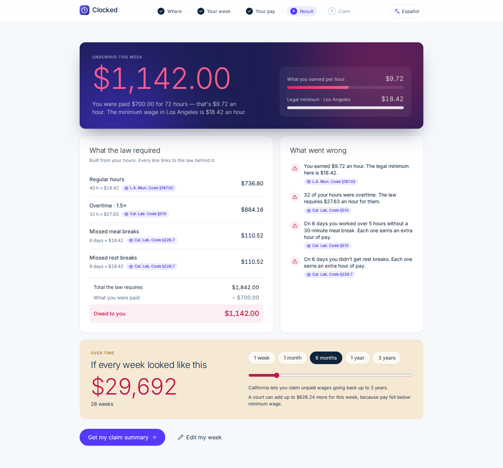

# Clocked

**See exactly what your boss owes you.**

Clocked is a California wage-theft checker. A worker describes their week ("Mon–Sat, 8am to 8pm, no break"), enters what they were paid, and Clocked applies California wage law — minimum wage, daily and weekly overtime, double time, missed meal and rest breaks — to show, line by line and with a citation on every line, how much they are owed. It ends with a claim-ready summary for a free Labor Commissioner wage claim. English and Spanish.

Built for LexHack 2026 · Access to Justice & Civic Tech.



## Try it

| Link | What it does |
|---|---|
| `/` | Landing page |
| `/check` | The checker, from scratch |
| `/check?demo=rosa` | Jumps straight to the example result (Rosa, dishwasher, Los Angeles) |
| `/check?demo=play` | **Hands-free demo** — plays the whole story on its own, for screen recording |
| `/check?demo=play&lang=es` | The same demo in Spanish |

## How it works: AI reads, the law decides

```
"Mon–Sat, 8am to 8pm, no break"
        │
        ▼
  Schedule reader ── built-in parser (English + Spanish, instant, offline)
        │            └─ falls back to the Claude API only for messy text
        ▼
  Worker confirms the shifts on a calendar
        │
        ▼
  Wage engine ────── plain TypeScript, no AI, 35 unit tests
        │            every number comes from src/lib/wage/law.ts
        ▼
  Result: gap this week, cited ledger, violations, 3-year projection
        │
        ▼
  Claim summary (printable) + next steps
```

The AI never computes money. Its only job is turning words into shifts, and its output is re-validated before the engine sees it. If no API key is set, the app still works end to end.

## The law it encodes

| Rule | Source |
|---|---|
| State minimum wage $16.90/h (2026) | Cal. Lab. Code §1182.12 |
| Los Angeles $18.42 · San Francisco $19.61 · San José $18.45 · Oakland $17.34 | Local ordinances (see `law.ts`) |
| Overtime 1.5× after 8 h/day and 40 h/week; 2× after 12 h/day; 7th consecutive day | Cal. Lab. Code §510 |
| A flat weekly amount covers 40 regular hours | Cal. Lab. Code §515(d) |
| Meal period required after 5 hours | Cal. Lab. Code §512 |
| One extra hour of pay per day for a missed meal or rest break | Cal. Lab. Code §226.7 |
| Liquidated damages when pay falls below minimum wage | Cal. Lab. Code §1194.2 |
| Three-year lookback for wage claims | Cal. Code Civ. Proc. §338(a) |
| Protection from retaliation; protections apply regardless of immigration status | Cal. Lab. Code §§98.6, 1171.5 |

Rates verified September 2026. Several cities adjust on July 1 and the state adjusts on January 1.

## Run it locally

```bash
npm install
npm run dev          # http://localhost:3000
npm test             # wage engine + parser tests
npm run typecheck
npm run lint
npm run build
```

Optional: copy `.env.example` to `.env.local` and set `ANTHROPIC_API_KEY` to enable the AI reader for messy descriptions.

## Deploy

Import the repo into Vercel (framework preset: Next.js). Add `ANTHROPIC_API_KEY` as an environment variable if you want the AI reader. No other configuration.

## Project layout

```
src/lib/wage/law.ts        the law, as data, with citations
src/lib/wage/engine.ts     the deterministic wage engine
src/lib/wage/parse.ts      English/Spanish schedule parser
src/app/api/parse-week     optional Claude reader for messy text
src/components/checker/    the 5-step flow (where, week, pay, result, claim)
src/components/landing/    landing page
src/lib/i18n.tsx           English and Spanish copy
DESIGN.md                  design tokens (Stripe-inspired, from awesome-design-md)
docs/                      Devpost write-up, video script, screenshots
```

## Legal

Clocked provides legal information, not legal advice. It does not represent anyone or file anything on a worker's behalf.
